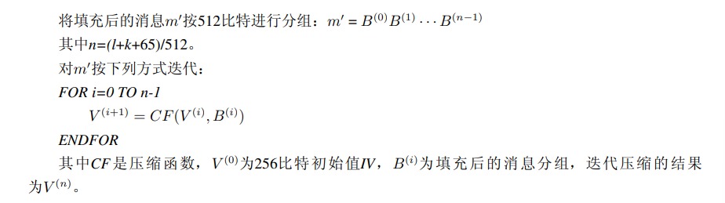
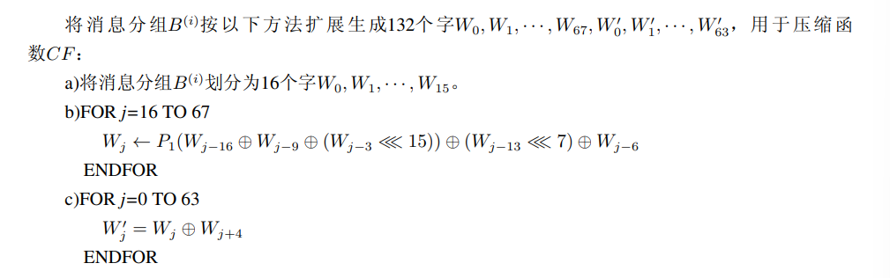
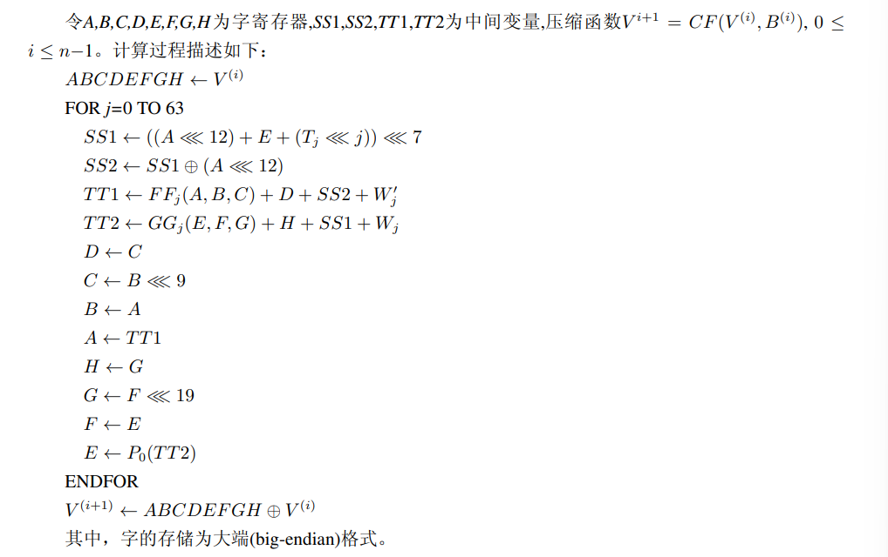

# SM3: :boom::boom::boom:
### Original:http://www.sca.gov.cn/sca/xwdt/2010-12/17/1002389/files/302a3ada057c4a73830536d03e683110.pdf
### 一、符号：
    ABCDEFGH：8个字寄存器或它们的值的串联
    B(i)：第i个消息分组
    CF：压缩函数
    FF_j：布尔函数，随j的变化取不同的表达式
    GG_j：布尔函数，随j的变化取不同的表达式
    IV：初始值，用于确定压缩函数寄存器的初态
    P0：压缩函数中的置换函数
    P1：消息扩展中的置换函数
    T_j：常量，随j的变化取不同的值
    m：消息
    m′：填充后的消息
    mod：模运算
    ∧：32比特与运算
    ∨：32比特或运算
    ⊕：32比特异或运算
    ¬：32比特非运算
    +：mod 2^32算术加运算
    ≪ k：循环左移k比特运算
    ←：左向赋值运算符
### 二、常数与函数
* IV=`7380166f 4914b2b9 172442d7 da8a0600 a96f30bc 163138aa e38dee4d b0fb0e4e`
* T_ j： 
    `0≤j≤15：T_ j=79cc4519` 
    `16≤j≤63：T_ j=7a879d8a`
* FF_ j(X, Y, Z)：其中X、Y、Z为字 
    `0≤j≤15：X ⊕ Y ⊕ Z` 
    `16≤j≤63：(X ∧ Y) ∨ (X ∧ Z) ∨ (Y ∧ Z)`   
* GG_ j(X, Y, Z)： 
    `0≤j≤15：X ⊕ Y ⊕ Z` 
    `16≤j≤63：(X ∧ Y) ∨ (¬X ∧ Z)`
* P0(X)=`X ⊕ (X ≪ 9) ⊕ (X ≪ 17)`，其中X为字
* P1(X)=`X ⊕ (X ≪ 15) ⊕ (X ≪ 23)`
### 三、算法描述
#### 3.1 概述
    对长度为l(l < 2^64) 比特的消息m，SM3杂凑算法经过填充和迭代压缩，生成杂凑值，杂凑值长度为256比特。
#### 3.2 填充
    假设消息m的长度为l比特。首先将比特"1"添加到消息的末尾，再添加k个"0"，k是满足l + 1 + k ≡ 448 mod 512的最小的非负整数。然后再添加一个64位比特串，该比特串是长度l的二进制表示。填充后的消息m′ 的比特长度为512的倍数。
#### 3.3 迭代压缩
* 迭代过程：

* 消息扩展：

* 压缩函数：

#### 3.4 杂凑值
    ABCDEFGH ← V(n)
    输出256比特的杂凑值 y=ABCDEFGH

# SM2: :boom::boom::boom:
### Original:https://blog.csdn.net/m0_57291352/article/details/123693837
