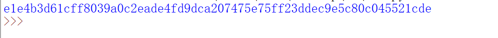
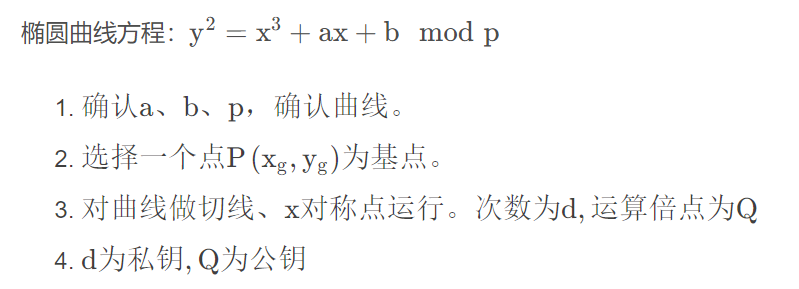
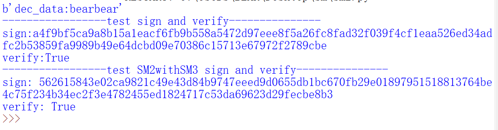
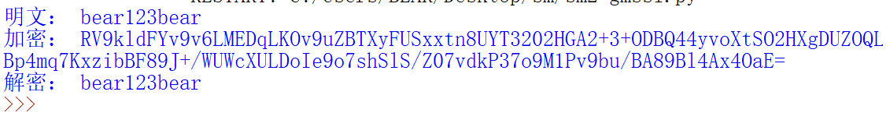
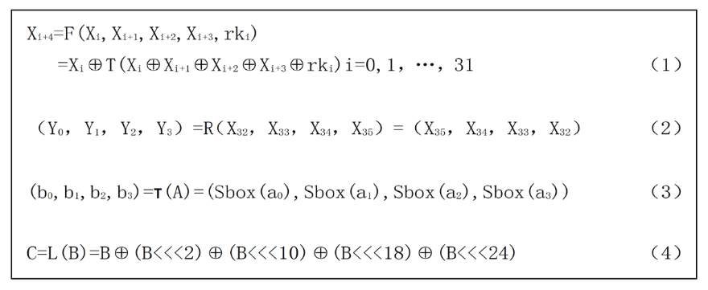

# SM3: :boom::boom::boom:
### Original: 
http://www.sca.gov.cn/sca/xwdt/2010-12/17/1002389/files/302a3ada057c4a73830536d03e683110.pdf
### 一、符号：
    ABCDEFGH：8个字寄存器或它们的值的串联
    B(i)：第i个消息分组
    CF：压缩函数
    FF_j：布尔函数，随j的变化取不同的表达式
    GG_j：布尔函数，随j的变化取不同的表达式
    IV：初始值，用于确定压缩函数寄存器的初态
    P0：压缩函数中的置换函数
    P1：消息扩展中的置换函数
    T_j：常量，随j的变化取不同的值
    m：消息
    m′：填充后的消息
    mod：模运算
    ∧：32比特与运算
    ∨：32比特或运算
    ⊕：32比特异或运算
    ¬：32比特非运算
    +：mod 2^32算术加运算
    ≪ k：循环左移k比特运算
    ←：左向赋值运算符
### 二、常数与函数
* IV=`7380166f 4914b2b9 172442d7 da8a0600 a96f30bc 163138aa e38dee4d b0fb0e4e`
* T_ j： 
    `0≤j≤15：T_ j=79cc4519` 
    `16≤j≤63：T_ j=7a879d8a`
* FF_ j(X, Y, Z)：其中X、Y、Z为字 
    `0≤j≤15：X ⊕ Y ⊕ Z` 
    `16≤j≤63：(X ∧ Y) ∨ (X ∧ Z) ∨ (Y ∧ Z)`   
* GG_ j(X, Y, Z)： 
    `0≤j≤15：X ⊕ Y ⊕ Z` 
    `16≤j≤63：(X ∧ Y) ∨ (¬X ∧ Z)`
* P0(X)=`X ⊕ (X ≪ 9) ⊕ (X ≪ 17)`，其中X为字
* P1(X)=`X ⊕ (X ≪ 15) ⊕ (X ≪ 23)`
### 三、算法描述
#### 3.1 概述
    对长度为l(l < 2^64) 比特的消息m，SM3杂凑算法经过填充和迭代压缩，生成杂凑值，杂凑值长度为256比特。
#### 3.2 填充
    假设消息m的长度为l比特。首先将比特"1"添加到消息的末尾，再添加k个"0"，k是满足l + 1 + k ≡ 448 mod 512的最小的非负整数。然后再添加一个64位比特串，该比特串是长度l的二进制表示。填充后的消息m′ 的比特长度为512的倍数。
#### 3.3 迭代压缩
* 迭代过程：

* 消息扩展：

* 压缩函数：

#### 3.4 杂凑值
    ABCDEFGH ← V(n)
    输出256比特的杂凑值 y=ABCDEFGH
### 四、运行结果
    明文：bear
    结果：

# SM2: :boom::boom::boom:
### Original: 
https://blog.csdn.net/m0_57291352/article/details/123693837 
https://github.com/gongxian-ding/gmssl-python/blob/master/gmssl/sm2.py
### 一、算法简述
        SM2是一种非对称密码算法，基于椭圆曲线密码的公钥密码算法标准，其密钥长度256bit，
    包含数字签名、密钥交换和公钥加密，用于替换RSA/DH/ECDSA/ECDH等国际算法。可以满足电子
    认证服务系统等应用需求，由国家密码管理局于2010年12月17号发布。
        SM2采用的是ECC 256位的一种，其安全强度比RSA 2048位高，且运算速度快于RSA。随着密
    码技术和计算技术的发展，目前常用的1024位RSA算法面临严重的安全威胁，我们国家密码管理部
    门经过研究，决定采用SM2椭圆曲线算法替换RSA算法。SM2算法在安全性、性能上都具有优势。
### 二、获取公私钥

    其中**密钥对**的生成如下： 
    1.产生随机整数d[1,n-2]
    2.G为基点，计算点P=(xP,yP)=[d]G
    3.密钥对为(d,P)，其中d为私钥，P为公钥
### 三、SM2加密
    M为明文字符串
    1.获取随机数k
    2.(x1,y1)=[k]G
    3.S=[h]P，h为余因子
    4.C1=(x2,y2)=[k]P
    5.t=KDF(x2||y2,klen)，klen为M的长度，KDF是sm2的密钥派生函数
    6.C2=M+t
    7.C3=Hash(x2||M||y2)
    8.C=C1||C2||C3
### 四、SM2解密
    C为密文字符串，klen为密文中C2的长度
    1.C1=C里面获取，验证C1是否满足椭圆曲线，C2长度确定，可以获取C1内容
    2.S=[h]C1，S为无穷点，退出
    3.(x2,y2)=[d]C1
    4.t=KDF(m2||y2,klen)
    5.M~=C2+t
    6.u=Hash(x2||M~||y2)
    7.M~为明文
### 五、运行结果
* sm2:

* sm2-gmssl:

# SM4: :boom::boom::boom:
### Original: 
https://blog.csdn.net/qq_41610725/article/details/116795599 
https://wenku.baidu.com/view/e4c4404f1b2e453610661ed9ad51f01dc3815701?fr=xueshu
### 一、算法介绍
        与DES和AES算法类似，SM4算法是一种分组密码算法。其分组长度为128bit，密钥长度也为128bit。
    加密算法与密钥扩展算法均采用32轮非线性迭代结构，以字（32位）为单位进行加密运算，每一次迭代运
    算均为一轮变换函数F。SM4算法加/解密算法的结构相同，只是使用轮密钥相反，其中解密轮密钥是加密轮
    密钥的逆序。SM4有很高的灵活性，所采用的S盒可以灵活地被替换，以应对突发性的安全威胁。算法的32
    轮迭代采用串行处理，这与AES中每轮使用代换和混淆并行地处理整个分组有很大不同。
### 二、密钥处理
* 加密密钥长度为128比特，分为四项32位的字。 
    MK=(MK0,MK1,MK2,MK3)
* 系统参数，每项为32位的字。 
    FK=(FK0,FK1,FK2,FK3)=(0xa3b1bac6, 0x56aa3350, 0x677d9197, 0xb27022dc)
* 固定参数，用于密钥扩展算法，每项为32位的字。 
CK=(CK0,CK1,...,CK31) 
  =(0x00070e15, 0x1c232a31, 0x383f464d, 0x545b6269,  
    0x70777e85, 0x8c939aa1,0xa8afb6bd, 0xc4cbd2d9, 
    0xe0e7eef5, 0xfc030a11, 0x181f262d, 0x343b4249,  
    0x50575e65, 0x6c737a81, 0x888f969d, 0xa4abb2b9, 
    0xc0c7ced5, 0xdce3eaf1, 0xf8ff060d, 0x141b2229, 
    0x30373e45, 0x4c535a61, 0x686f767d, 0x848b9299, 
    0xa0a7aeb5, 0xbcc3cad1, 0xd8dfe6ed, 0xf4fb0209,  
    0x10171e25, 0x2c333a41, 0x484f565d, 0x646b7279)
* 轮密钥，每项为32位的字，由密钥扩展算法生成。(rk0,rk1,...,rk31)
#### 密钥扩展算法：
    1.密钥与系统参数异或：
         (K0,K1,K2,K3)=(MK0⊕FK0,MK1⊕FK1,MK2⊕FK2,MK3⊕FK3)
    2.获取子密钥：
         rk_i=K_i+4=K_i⊕T'(K_i+1⊕K_i+2⊕K_i+3⊕CK_i)
         其中 T：B⊕(B<<<13)⊕(B<<<23)
### 三、加密算法
        加密算法包含32次迭代运算和1次反序变换R，假设输入明文为(X0,X1,X2,X3)，密文输出
    为(Y0,Y1,Y2,Y3)，轮密钥为rk_i(i=0,1,...,31)。

    1.首先执行32次迭代运算，如（1）式所示。 
    2.对最后一轮数据进行反序变换并得到密文输出，如（2）式所示。 
    `（1）和（2）中的T是可逆变换，由非线性变换τ和线性变换L复合而成，即T(·)=L(τ(·))。
    其中τ使用4个S盒并行组成，如（3）式所示。L是线性变换，如（4）式所示。`
