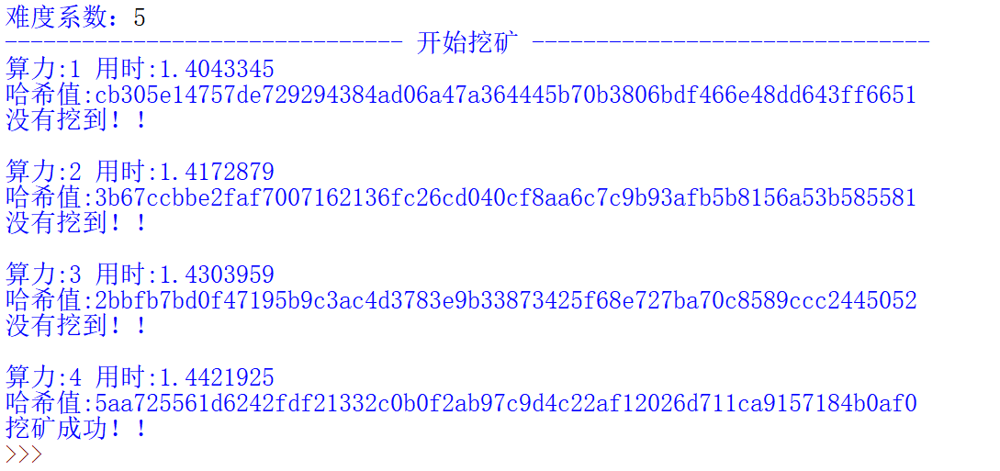

# 比特币挖矿 :smiling_imp:
### Original: 
https://www.jianshu.com/p/4f05e4cfad3c 
https://www.528btc.com/ask/161778863955943.html
### 一、去中心化
    比特币的去中心化共识由所有网络节点的4种独立过程相互作用而产生：
    1.每个全节点依据综合标准对每个交易进行独立验证
    2.通过完成工作量证明算法的验算，挖矿节点将交易记录独立打包进新区块
    3.每个节点独立地对新区块进行校验并组装进区块链
    4.每个节点对区块链进行独立选择，在工作量证明机制下选择累计工作量最大的区块链
### 二、挖矿机制
        区块链最初的创始人中本聪就设计一个特殊的机制。大家都能参与进来做数据处理，处理得最快最好的能获得数据的记账权，并获得响应的比特币奖励（实际
    也是比特币的发行过程）。“最快最好”明确要经历一系列流程。首先矿工们要收集还没有被记录的原始交易信息，检查一下这些信息是否有问题，并将其归到一个
    数据块中。而每隔一段时间（大约10分钟左右），就需要大家进行数据处理，而且只有一个人可以记账成功。矿工们在打包好数据块之后，需要通过解决一系列密
    码学难题来争夺唯一的记账权。每一个比特币的节点都会收集所有尚未确认的交易，并将其归集到一个数据块中，这个数据块会和前面一个数据块集成在一起。矿
    工节点会附加一个随机调整数，并计算前一个数据块的SHA-256哈希运算值。挖矿节点不断重复进行尝试，直到它找到的随机调整数使得产生的哈希值低于某个特
    定的目标。当矿工找到符合要求的哈希值之后，就可以向全网广播自己的处理结果，其他矿工接收并检验这个数据块是否符合规则。如果大部分觉得没有什么问题，
    满足要求的话，那么这个矿工打包好的数据块就会连接到整个区块链上，被所有人接受，并获得相应的比特币奖励，这就是比特币挖矿的工作原理。
        比特币挖矿就是基于哈希算法进行的一系列哈希运算，得到匹配条件的新的区块哈希值的过程。哈希运算逻辑很简单，就是根据已知参数利用哈希算法得出一
    个哈希值，如果哈希值满足条件则挖矿成功，不满足则继续改变参数进行运算并得到新的哈希值，直到满足条件为止。因为哈希算法中输入的参数与输出的哈希值没
    有任何逻辑关系，所以想要得到正确的结果只能不停的改变输入参数进行计算，不停地试错，直到找到正确的值。
        目标决定了难度，进而影响求解工作量证明算法所需要的时间。比特币的区块平均每10分钟生成一个。这就是比特币的心跳，是货币发行速率和交易达成速度的
    基础。不仅是在短期内，而是在几十年内它都必须要保持恒定。在此期间，计算机性能将飞速提升。此外，参与挖矿的人和计算机也会不断变化。为了能让新区块的
    保持10分钟一个的产生速率，挖矿的难度必须根据这些变化进行调整。事实上，难度是一个动态的参数，会定期调整以达到每10分钟一个新区块的目标。简单地说，
    难度被设定在，无论挖矿能力如何，新区块产生速率都保持在10分钟一个。难度的调整是在每个完整节点中独立自动发生的。每2,016个区块(2周产生的区块)中的所
    有节点都会调整难度。难度的调整公式是由最新2,016个区块的花费时长与20,160分钟（两周，即这些区块以10分钟一个速率所期望花费的时长）比较得出的。难度
    是根据实际时长与期望时长的比值进行相应调整的（或变难或变易）。简单来说，如果网络发现区块产生速率比10分钟要快时会增加难度。如果发现比10分钟慢时则
    降低难度。为了防止难度的变化过快，每个周期的调整幅度必须小于一个因子（值为4）。如果要调整的幅度大于4倍，则按4倍调整。由于在下一个2,016区块的周期
    不平衡的情况会继续存在，所以进一步的难度调整会在下一周期进行。因此平衡哈希计算能力和难度的巨大差异有可能需要花费几个2,016区块周期才会完成。
### 运行结果:

